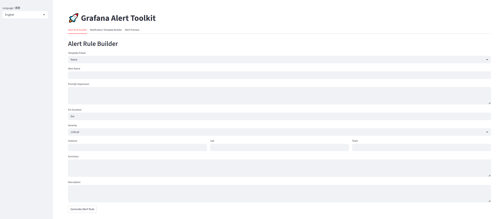
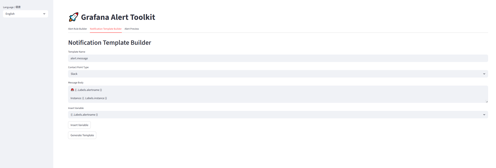
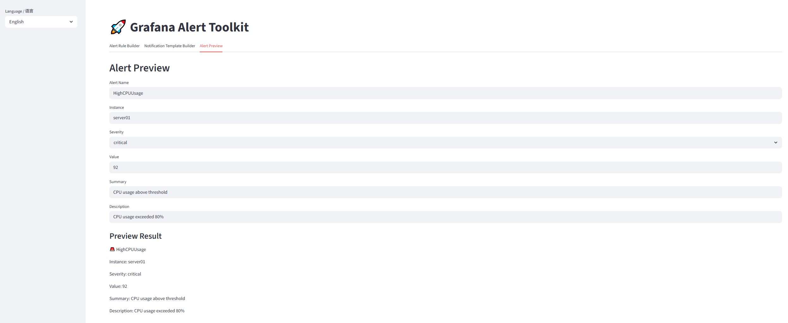

# 🚀 Grafana Alert Toolkit

[中文](README_CN.md) | [English](README.md)

A web-based tool for quickly generating Grafana alert rules (YAML) and notification templates (Go Template) with real-time preview support.

<div align="center">
  <div style="display: flex; justify-content: center; gap: 20px; align-items: flex-start;">
    <div style="display: flex; flex-direction: column; align-items: center; width: 30%;">
      
      <div style="margin-top: 10px;">
        <strong>📊 Alert Rule Generator</strong>
      </div>
    </div>
    <div style="display: flex; flex-direction: column; align-items: center; width: 30%;">
      
      <div style="margin-top: 25px;">
        <strong>💬 Notification Template Generator</strong>
      </div>
    </div>
    <div style="display: flex; flex-direction: column; align-items: center; width: 30%;">
      
      <div style="margin-top: 10px;">
        <strong>🔍 Alert Preview</strong>
      </div>
    </div>
  </div>
</div>

---

## 🏗️ Features

- **Alert Rule Generator**  
  Create alert rules using PromQL, severity levels, duration, and labels, then generate Grafana-compatible YAML.

- **Notification Template Generator**  
  Build templates for Slack, Email, Webhook, Teams with support for Grafana template variables (`.Labels`, `.Annotations`), export as Go Template `.tmpl` files.

- **Alert Preview**  
  Simulate alert notifications and render template examples in real-time.

- **Multi-language UI**  
  Support for switching between Chinese and English.

---

## ⚙️ Quick Start

### Requirements

- Python 3.7 or higher
- pip package manager

### Installation Steps

1. Clone the repository:

   ```bash
   git clone <repo_url>
   cd grafana-alert-toolkit
   ```

2. Install dependencies:

   ```bash
   pip install -r requirements.txt
   ```

3. Start the application:

   ```bash
   streamlit run app.py
   ```

4. Open your browser and visit:

   ```
   http://localhost:8501
   ```

---
